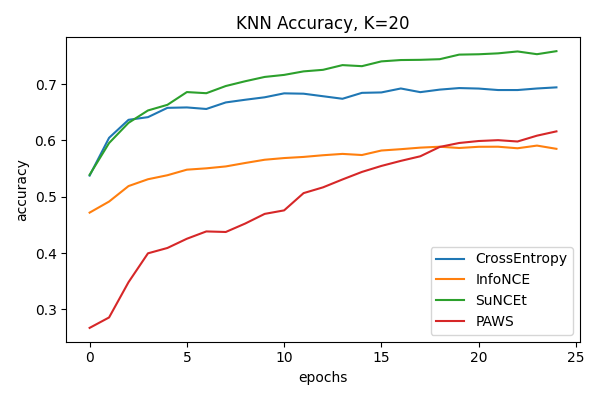
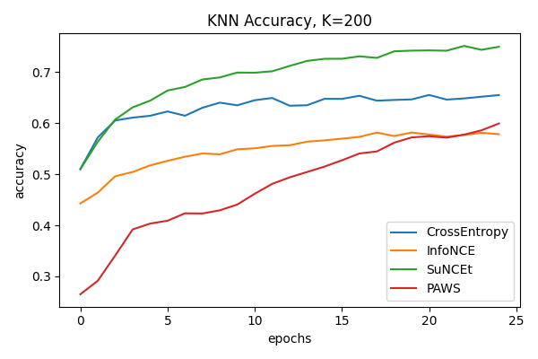

# Semi-supervised Representation Learning for Image Classification with Keras

This repository contains an implementation of 4 methods for semi-supervised representation learning:
- **CrossEntropy**: supervised baseline
- [**InfoNCE**](https://arxiv.org/abs/1807.03748): self-supervised baseline ([SimCLR](https://arxiv.org/abs/2002.05709) without projection head)
- [**SuNCEt**](https://arxiv.org/abs/2006.10803): InfoNCE + supervised contrastive learning
- [**PAWS**](https://arxiv.org/abs/2104.13963): negative-free method with non-parametric pseudo-labels (can be seen as [DINO](https://arxiv.org/abs/2104.14294) + pseudo-labels)

Try it out in this Colab Notebook: 

The trained encoders do not have a classification head except CrossEntropy. All methods are trained on the [STL10](https://ai.stanford.edu/~acoates/stl10/) dataset, and the representations are evaluated using the accuracy of a k-nearest neighbour classifier. The encoder uses a simple convolutional architecture.

The codebase follows modern Tensorflow2 + Keras best practices and the implementation seeks to be as concise and readable as possible. This implementation is intended to be used as an easy-to-use baseline instead of as a line-by-line reproduction of the papers. 

The image augmentation pipeline is an important component of all these methods. You can find implementations of other custom Keras image augmentation layers in [this repository](https://github.com/beresandras/image-augmentation-layers-keras).

## Results

In CrossEntropy, SuNCEt and PAWS the labeled part of the dataset is repeated 20 times so that the labeled and unlabeled batch sizes can be the same size (this is not necessary, just a design choice). Therefore for these methods 1 epoch means 20 epochs over the labeled part of the dataset, and 1 epoch over the unlabeled part.